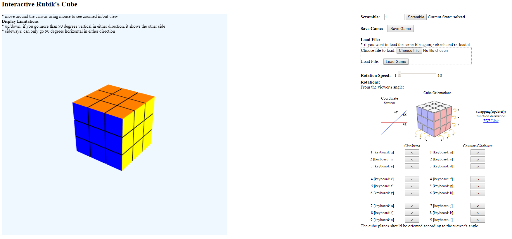

#### Interactive Rubik's Cube
> Project 1: Rubik's Cube
- This Rubik's Cube tool is designed for the user to be able to interactively play with rotating sides, randomly shuffling, and saving and loading status with mouse and keyboard. 
  - Functionalities:
    - Scramble, Save/Load States, Change rotation speed, Rotate around each axis/direction

Rotation calcuation: [PDF1]

[PDF1]: https://github.com/andyj1/WebGL_Graphics/blob/master/Project1_Rubiks_Cube/Rotation%20Results%20by%20axis.pdf

#### Environment Mapping using Skybox
> Project 2: Environment Mapping
- This project is aimed to demonstrate to the user how an environment mapping is portrayed on a skybox, by means of viewing the rendered image with varied parameters such as angle of view (perspective) and lighting. For more details, refer to the writeup [PDF2].
  - Functionalities:
    - Users can see effects of the eye position (x,y,z), light position (x,y,z), shininess of the object, scale of the object, perspective angle of the camera
    - Surrounding images (Skybox), as well as the floating reflective object can be changed. The reflective object input is in 3D-object (.obj) file, where the coordinates are parsed and drawn on canvas. Currently only a number of primitive shapes are read in (i.e. vertex, face). (Refer to [Link] for information about OBJ filetype) 
    - The surrounding images are taken from a number of freely available websites.

[Link]: http://martinreddy.net/gfx/3d/OBJ.spec
[PDF2]: https://github.com/andyj1/WebGL_Graphics/blob/master/Project2_Environment-Mapping/Jeong_FinalProject_Writeup.pdf

