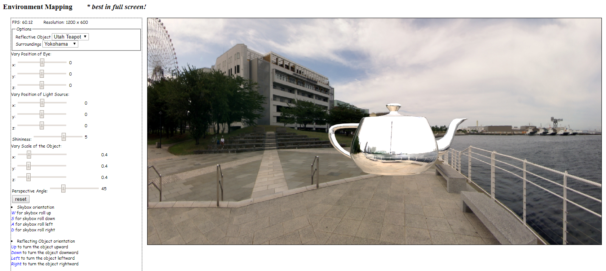

#### Interactive Rubik's Cube
> Project 1: Rubik's Cube
- This Rubik's Cube tool is designed for the user to be able to interactively play with rotating sides, randomly shuffling, and saving and loading status with mouse and keyboard. Rotation calcuation: [PDF1]

[PDF1]: https://github.com/andyj1/WebGL_Graphics/blob/master/Project1_Rubiks_Cube/Rotation%20Results%20by%20axis.pdf

#### Environment Mapping using skybox
> Project 2: Environment Mapping
- This project is aimed to demonstrate to the user how an environment mapping is portrayed on a skybox, by means of viewing the rendered image with varied parameters such as angle of view (perspective) and lighting. For more details, refer to the writeup [PDF2].

[PDF2]: https://github.com/andyj1/WebGL_Graphics/blob/master/Project2_Environment-Mapping/Jeong_FinalProject_Writeup.pdf

